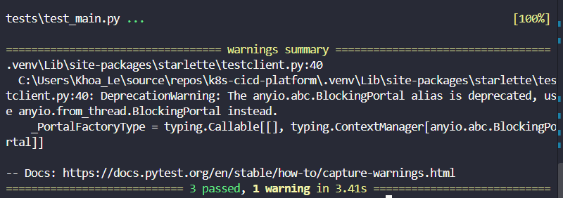
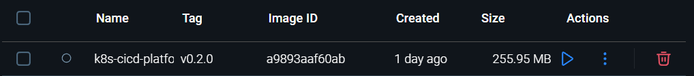
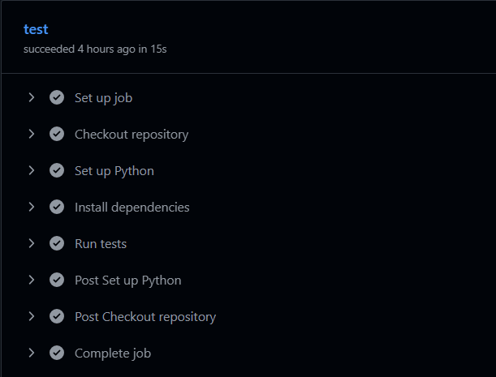

# Production-like Kubernetes CI/CD Platform

[](https://github.com/hako-spec1al/k8s-cicd-platform/actions/workflows/ci.yml)

## Project overview

Small FastAPI service used to demonstrate a production-like delivery path:

`code -> tests -> Docker image -> Kubernetes -> observability`

Current architecture:

- FastAPI API with `/health`, `/ready`, and `/version`
- Docker runtime with a non-root `appuser`
- GitHub Actions CI for pull requests and pushes to `main`
- Kubernetes manifests for local deployment with probes, resources, and rolling updates

## Phase 1: API foundation

- Added the REST endpoints `/health`, `/ready`, and `/version`.
- Added `APP_VERSION` runtime configuration.
- Added pytest unit tests.

## Phase 2: Dockerization

- Built image `k8s-cicd-platform:v0.2.0` successfully.
- Runs as non-root user `appuser` and exposes port `8000`.
- Verified all API endpoints through the published container port.

Build the image:

```powershell
docker build -t k8s-cicd-platform:v0.2.0 .
```

Run the container:

```powershell
docker run --rm -p 8000:8000 -e APP_VERSION=v0.2.0 k8s-cicd-platform:v0.2.0
```

Verify the containerized API:

```powershell
Invoke-RestMethod http://localhost:8000/health
Invoke-RestMethod http://localhost:8000/ready
Invoke-RestMethod http://localhost:8000/version
```

## Phase 3: CI

- Added GitHub Actions workflow for pull requests and pushes to `main`.
- Dependency installation and pytest run successfully in CI.
- Evidence: CI completed with `3 passed`; release tag `v0.3.0` was created on `main`.

## Run locally

```powershell
python -m venv .venv
.\.venv\Scripts\Activate.ps1
pip install -r requirements.txt
pytest
uvicorn app.main:app --reload
```

Open `http://localhost:8000/docs` for the API documentation.

## Verification evidence

- [x] Phase 1 tests: `3 passed`.
      
- [x] Phase 2 image: `k8s-cicd-platform:v0.2.0`.
      
- [x] Phase 3 CI: `3 passed`, released as `v0.3.0`.
      
