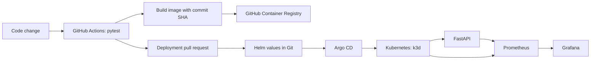

# Kubernetes CI/CD Platform

[](https://github.com/hako-spec1al/k8s-cicd-platform/actions/workflows/ci.yml)

A DevOps portfolio project demonstrating an end-to-end delivery workflow for a FastAPI service: automated testing, immutable container images, Kubernetes deployment with Helm and GitOps, and application observability. Phase 8 is in progress. The local lab is being moved to GitHub Codespaces because of host resource constraints.

## Architecture


```mermaid
flowchart LR
    Dev[Code change] --> CI[GitHub Actions: pytest]
    CI --> Image[Build image with commit SHA]
    Image --> GHCR[GitHub Container Registry]
    CI --> PR[Deployment pull request]
    PR --> Git[Helm values in Git]
    Git --> Argo[Argo CD]
    Argo --> K8s[Kubernetes: k3d]
    K8s --> API[FastAPI]
    API --> Prom[Prometheus]
    K8s --> Prom
    Prom --> Grafana[Grafana]
```

Helm declares the desired deployment state in Git, and Argo CD reconciles the cluster against it. Images use commit-SHA tags to support traceability from a deployment back to its source revision.

## Technology Stack

- **Application:** Python 3.11, FastAPI, pytest
- **Containerization:** Docker, GitHub Container Registry (GHCR)
- **CI/CD:** GitHub Actions
- **Kubernetes:** k3d, kubectl, Traefik
- **Packaging and GitOps:** Helm, Argo CD
- **Observability:** Prometheus, Grafana, ServiceMonitor, PrometheusRule
- **Phase 8 development environment:** GitHub Codespaces with Docker-in-Docker

## Run Locally

Prerequisite: Python 3.11 or later.

```powershell
python -m venv .venv
.\.venv\Scripts\Activate.ps1
python -m pip install -r requirements.txt
python -m pytest -q
uvicorn app.main:app --reload
```

API documentation: `http://127.0.0.1:8000/docs`. Health endpoints: `/health`, `/ready`, and `/version`.

## Codespaces and Kubernetes

On GitHub, select **Code → Codespaces** and create a Codespace from the branch you want to work on. [`.devcontainer/devcontainer.json`](.devcontainer/devcontainer.json) configures Docker-in-Docker, kubectl, Helm, and forwarded ports for the API, Argo CD, and Grafana.

The bootstrap script is [`setup-codespaces.sh`](setup-codespaces.sh). It deletes and recreates the k3d cluster named `platform`; use it only in a dedicated Codespace after reviewing the script. A successful Codespaces deployment has not yet been verified on this branch.

For a local Kubernetes lab, install Docker Desktop, kubectl, k3d, and Helm. See [Phase 4](docs/phases/phase-4-kubernetes.md) for deployment details and the [operations runbook](docs/runbooks/operational-commands.md) for common commands.

## Project Phases

- [Phase 1: API Foundation](docs/phases/phase-1-api-foundation.md)
- [Phase 2: Containerization](docs/phases/phase-2-containerization.md)
- [Phase 3: CI Pipeline](docs/phases/phase-3-ci-pipeline.md)
- [Phase 4: Kubernetes Deployment](docs/phases/phase-4-kubernetes.md)
- [Phase 5: Helm Chart](docs/phases/phase-5-helm.md)
- [Phase 6: Argo CD GitOps](docs/phases/phase-6-argocd-gitops.md)
- [Phase 7: CI/CD Integration](docs/phases/phase-7-cicd.md)
- [Phase 8: Observability (in progress)](docs/phases/phase-8-observability.md)

## Operations and Project Notes

- [Project roadmap](docs/roadmap.md)
- [Context handoff](docs/context-handoff.md)
- [Operations runbook](docs/runbooks/operational-commands.md)
- [Incident report: local resource starvation](docs/incidents/2026-09-resource-starvation.md)
- [Rollout availability check script](docs/scripts/verify-zero-downtime.ps1)

## Current Status

Phases 1–7 are complete based on the project history; Phase 8 is in progress. See the [roadmap](docs/roadmap.md) and [context handoff](docs/context-handoff.md) for current caveats. The current CI workflow does not include a Trivy image scan; security scanning remains outstanding.
